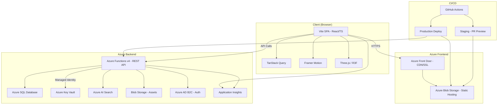

# Infinity Platform — Features, Purpose & Functions

> A comprehensive guide to the Infinity digital platform, designed for stakeholders, developers, and collaborators.

---

## Table of Contents

1. [Purpose](#1-purpose)
2. [The Three Brands ("The Trinity")](#2-the-three-brands-the-trinity)
3. [Customer-Facing Features](#3-customer-facing-features)
   - [3.1 Homepage ("Ground Zero")](#31-homepage-ground-zero)
   - [3.2 The Trinity Hub](#32-the-trinity-hub-the-trinity)
   - [3.3 Editions — Ecommerce](#33-editions--ecommerce-editions)
   - [3.4 Encounter — Events & Ticketing](#34-encounter--events--ticketing-encounter)
   - [3.5 Account Area](#35-account-area-account)
   - [3.6 Global UI Elements](#36-global-ui-elements)
4. [Admin Panel (CMS & CRM)](#4-admin-panel-cms--crm)
   - [4.1 Dashboard](#41-dashboard-admin)
   - [4.2 Content Management (CMS)](#42-content-management-cms)
   - [4.3 Customer Relationship Management (CRM)](#43-customer-relationship-management-crm)
   - [4.4 Admin Features](#44-admin-features)
5. [Technical Architecture](#5-technical-architecture)
   - [5.1 Frontend Stack](#51-frontend-stack)
   - [5.2 Backend Architecture (Azure)](#52-backend-architecture-azure)
   - [5.3 API Layer](#53-api-layer)
   - [5.4 Telemetry](#54-telemetry)
6. [Design System](#6-design-system)
7. [CI/CD & Deployment](#7-cicd--deployment)
8. [CMS Block System](#8-cms-block-system)
9. [SEO Implementation](#9-seo-implementation)
10. [Route Map (Quick Reference)](#10-route-map-quick-reference)

---

## 1. Purpose

**Infinity** is a premium lifestyle and culture platform built for the Bangladeshi market. It operates at the intersection of **fashion ecommerce**, **event ticketing**, and **brand storytelling** — unifying three distinct brand identities under one digital roof.

The platform serves two audiences:
- **Consumers** — who browse products, purchase merchandise, book event tickets, and engage with brand stories.
- **Administrators** — who manage inventory, events, customers, analytics, and marketing campaigns through a built-in CMS/CRM.

---

## 2. The Three Brands ("The Trinity")

| Brand | Identity | Color | Tagline |
|-------|----------|-------|---------|
| **NOVA** | Creative & artistic | Cyan | *Light Beyond Limits* |
| **Live The Moment** | Experiential & mindful | Purple | *Every Second Counts* |
| **X-Force** | Athletic & disruptive | Pink | *Defy. Disrupt. Dominate.* |

Each brand has its own dedicated page with editorial storytelling, curated product collections, and event listings.

---

## 3. Customer-Facing Features

### 3.1 Homepage ("Ground Zero")
- Cinematic hero section with animated infinity logo
- Smooth-scroll sections introducing the brand universe
- Trinity brand showcase with card-based navigation
- "Define Your Style" editorial video section
- WebGL distortion effects and particle sparkles

### 3.2 The Trinity Hub (`/the-trinity`)
- Overview page with brand cards linking to individual brand stories
- Featured product and event carousels
- Each brand page (`/the-trinity/nova`, `/live-the-moment`, `/x-force`) includes:
  - Hero imagery with brand logo
  - Multi-section editorial story (genesis, philosophy, community)
  - Brand-filtered product carousel
  - Brand-filtered event carousel
  - Newsletter signup

### 3.3 Editions — Ecommerce (`/editions`)
The full online shop experience:

| Page | Function |
|------|----------|
| **Editions Landing** | Category tiles, trending & new-drop carousels |
| **Category Page** (`/editions/c/:slug`) | Filterable product grid (price, size, availability), sorting, pagination |
| **Product Detail** (`/editions/p/:slug`) | Image gallery, variant selector (size/color), quantity picker, add-to-cart, wishlist, specs accordion, "You May Also Like" carousel |
| **Cart** (`/cart`) | Line items with quantity controls, promo code input, order summary |
| **Checkout** (`/checkout`) | Multi-step flow: Info → Shipping → Payment → Review |
| **Order Confirmation** (`/order/confirmed/:id`) | Success page with order summary |

**Key ecommerce capabilities:**
- Cart persisted to `localStorage` via React Context
- Promo code / discount support
- Multiple payment method placeholders (Stripe, bKash)
- Product variants (size, color)
- Compare-at pricing for sale items
- Stock availability tracking
- JSON-LD structured data for SEO

### 3.4 Encounter — Events & Ticketing (`/encounter`)
The event discovery and ticketing system:

| Page | Function |
|------|----------|
| **Encounter Landing** | Featured event hero, filterable event grid (date, location, price) |
| **Event Detail** (`/encounter/e/:slug`) | Banner, date/time/venue info, description, lineup/schedule, tiered ticket selector, FAQ accordion |
| **Ticket Checkout** (`/encounter/checkout/:id`) | Buyer info form, tier recap, payment |
| **Ticket Confirmation** (`/encounter/confirmed/:id`) | Confirmation with PDF/QR code download placeholders |

**Key event capabilities:**
- Multiple ticket tiers per event (e.g. General, VIP, Backstage)
- Per-tier quantity limits and remaining inventory
- Featured event highlighting
- FAQ section per event
- JSON-LD Event structured data

### 3.5 Account Area (`/account`)
- **Dashboard** — Overview cards: recent orders, saved addresses, wishlist count
- **Order History** (`/account/orders`) — Order list with status badges (processing, shipped, delivered, cancelled)
- **Order Detail** (`/account/orders/:id`) — Full order breakdown with status timeline
- **Saved Addresses** (`/account/addresses`) — CRUD for shipping addresses with default selection
- **Wishlist** (`/account/wishlist`) — Saved product grid with remove action

### 3.6 Global UI Elements
- **Navbar** — Route-aware, glassmorphic buttons with animated gradient borders, magnetic hover effect, Trinity dropdown, mobile hamburger drawer, cart badge
- **Footer** — 4-column layout (Brand, Shop, Experience, Support), newsletter signup, social links
- **Chatbot Launcher** — Floating button with gradient glow (bottom-right)
- **Breadcrumbs** — Contextual navigation on category, product, and event pages
- **Scroll Reveal** — Intersection Observer-based entrance animations
- **Grain Overlay & Sparkles** — Ambient visual texture across all pages
- **Splash Screen** — Animated infinity logo on initial load

---

## 4. Admin Panel (CMS & CRM)

Accessible at `/admin/login` (credentials: `admin@infinity.com` / `admin123`).

### 4.1 Dashboard (`/admin`)
- Real-time KPIs: DAU, MAU, unique visitors
- Performance analytics with date range filtering
- Live activity feed
- CSV and PDF export capabilities

### 4.2 Content Management (CMS)

| Module | Route | Functions |
|--------|-------|-----------|
| **Products** | `/admin/products` | List, create, edit, delete products with variants, images, pricing, and stock |
| **Product Form** | `/admin/products/:id` | Full product editor with brand, category, specs, tags, and variant management |
| **Events** | `/admin/events` | List, create, edit, delete events with ticket tiers |
| **Event Form** | `/admin/events/:id` | Full event editor with lineup, schedule, FAQ, and tier configuration |
| **Banners** | `/admin/banners` | Manage promotional banners across the site |
| **Discounts** | `/admin/discounts` | Create and manage promo codes and discount rules |
| **Orders** | `/admin/orders` | View all orders, update status, manage fulfillment |

### 4.3 Customer Relationship Management (CRM)

| Module | Route | Functions |
|--------|-------|-----------|
| **Customers** | `/admin/crm/customers` | Customer directory with segmentation and profiles |
| **Chatbot** | `/admin/crm/chatbot` | View chatbot conversation history, unread indicators with badge counts |
| **Messaging** | `/admin/crm/messaging` | Send email and push notification campaigns |
| **Analytics** | `/admin/crm/analytics` | Customer behavior analytics, engagement metrics |

### 4.4 Admin Features
- Sidebar navigation with notification badges (unread chatbot messages, new orders)
- Protected routes with admin authentication context
- Responsive admin layout

---

## 5. Technical Architecture

### Architecture Diagram

### 5.1 Frontend Stack
| Technology | Purpose |
|------------|---------|
| **React 18** | UI framework |
| **TypeScript** | Type safety |
| **Vite** | Build tool & dev server |
| **Tailwind CSS** | Utility-first styling with custom design tokens |
| **Framer Motion** | Animations & transitions |
| **React Router v6** | Client-side routing |
| **TanStack React Query** | Data fetching, caching, retry logic |
| **react-helmet-async** | SEO meta tags & JSON-LD |
| **Lenis** | Smooth scrolling |
| **Three.js / React Three Fiber** | WebGL effects |
| **Recharts** | Admin analytics charts |
| **Lucide React** | Icon library |
| **shadcn/ui** | Accessible component primitives (Dialog, Accordion, Tabs, etc.) |

### 5.2 Backend Architecture (Azure)
| Service | Purpose |
|---------|---------|
| **Azure Functions** (Node.js) | REST API endpoints for products, events, orders, CRM, search, discounts |
| **Azure SQL Database** | Persistent data store |
| **Azure Blob Storage** | Image and asset hosting |
| **Azure Static Web Apps** | Frontend hosting |
| **Azure Front Door** | CDN, custom domain, SSL |
| **Azure Key Vault** | Secrets management (DB credentials, API keys) |
| **Azure AD B2C** | Admin authentication |
| **Azure AI Search** | Full-text product and event search |
| **Application Insights** | Frontend and backend telemetry, performance monitoring |

### 5.3 API Layer
- **Mock mode**: In-memory data store used when no `VITE_API_BASE_URL` is set (default for local/preview)
- **Live mode**: Azure Functions HTTP triggers serve all data when the environment variable is configured
- API modules: `products`, `events`, `orders`, `discounts`, `catalog`, `search`, `crm-customers`, `crm-conversations`, `crm-messaging`

### 5.4 Telemetry
- Microsoft Application Insights SDK integrated
- Automatic tracking: page views, route changes, AJAX timing, unhandled errors
- Custom events: `add_to_cart`, `checkout_complete`, search queries, etc.
- Silently disabled when no connection string is configured

---

## 6. Design System

### 6.1 Visual Identity
- **Typography**: Outfit (display/headings) + Space Grotesk (body)
- **Color palette**: Dark-first theme with signature gradient accents:
  - `--infinity-cyan` — Creative/NOVA identity
  - `--infinity-purple` — Experiential/LTM identity
  - `--infinity-pink` — Athletic/X-Force identity
- **Buttons**: Glassmorphic with animated gradient borders ("infinity" variant)
- **Interactions**: Magnetic hover effect on buttons (spring physics), scroll-synced reveal animations

### 6.2 Responsive Design
- Mobile-first approach with Tailwind breakpoints
- Mobile navigation drawer
- Responsive grids across all listing pages
- Touch-friendly interactions

### 6.3 Accessibility
- Keyboard-accessible focus states
- WCAG AA color contrast
- Semantic HTML (`<header>`, `<main>`, `<section>`, `<nav>`)
- ARIA labels on interactive elements

---

## 7. CI/CD & Deployment

### 7.1 Production Pipeline
- **Trigger**: Push to `main` branch
- **Steps**: Install → Build → Deploy frontend to Azure Blob Storage → Deploy Azure Functions → Purge CDN cache

### 7.2 Staging Pipeline
- **Trigger**: Pull request opened/updated
- **Steps**: Build with staging env vars → Deploy to PR-specific path in staging storage → Comment preview URL on PR
- **Cleanup**: Staging assets auto-deleted when PR is closed

### 7.3 Infrastructure
- GitHub Actions for CI/CD
- Separate staging resources (storage account, function app, Front Door endpoint)
- Azure CLI provisioning scripts documented in project

---

## 8. CMS Block System

Reusable, composable content blocks that can be arranged on any page:

| Block | Description |
|-------|-------------|
| `HeroBlock` | Full-width image/video hero with title overlay |
| `EditorialText` | Large typography section with heading + body |
| `MediaGallery` | Responsive image/video grid |
| `SplitFeature` | Side-by-side image + copy layout |
| `QuoteBlock` | Centered testimonial with attribution |
| `ProductCarousel` | Horizontal scrollable product cards |
| `EventCarousel` | Horizontal scrollable event cards |
| `CTABand` | Full-width call-to-action strip |
| `NewsletterModule` | Email signup form section |

---

## 9. SEO Implementation

- Per-page `<title>` tags (under 60 characters) and meta descriptions (under 160 characters)
- Open Graph tags for social sharing
- Canonical URLs
- JSON-LD structured data (Product, Event schemas)
- Single `<h1>` per page matching search intent
- Semantic HTML throughout
- Lazy-loaded images with descriptive `alt` attributes
- `robots.txt` configured

---

## 10. Route Map (Quick Reference)

### Customer Routes
| Route | Page |
|-------|------|
| `/` | Homepage (Ground Zero) |
| `/the-trinity` | Trinity Hub |
| `/the-trinity/:brandSlug` | Brand Page (nova, live-the-moment, x-force) |
| `/editions` | Editions Landing |
| `/editions/c/:categorySlug` | Category / Product Listing |
| `/editions/p/:productSlug` | Product Detail |
| `/cart` | Shopping Cart |
| `/checkout` | Checkout Flow |
| `/order/confirmed/:orderId` | Order Confirmation |
| `/encounter` | Encounter Landing |
| `/encounter/e/:eventSlug` | Event Detail |
| `/encounter/checkout/:eventId` | Ticket Checkout |
| `/encounter/confirmed/:id` | Ticket Confirmation |
| `/account` | Account Dashboard |
| `/account/orders` | Order History |
| `/account/orders/:orderId` | Order Detail |
| `/account/addresses` | Saved Addresses |
| `/account/wishlist` | Wishlist |

### Admin Routes
| Route | Page |
|-------|------|
| `/admin/login` | Admin Login |
| `/admin` | Admin Dashboard |
| `/admin/products` | Product Management |
| `/admin/products/:id` | Product Editor |
| `/admin/events` | Event Management |
| `/admin/events/:id` | Event Editor |
| `/admin/banners` | Banner Management |
| `/admin/discounts` | Discount Management |
| `/admin/orders` | Order Management |
| `/admin/crm/customers` | Customer Directory |
| `/admin/crm/chatbot` | Chatbot Conversations |
| `/admin/crm/messaging` | Campaign Messaging |
| `/admin/crm/analytics` | CRM Analytics |

---

*Last updated: February 27, 2026*
